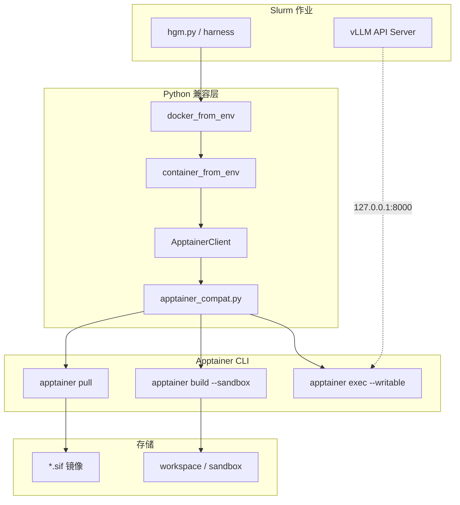

# MendelGM Apptainer Migration Guide

MendelGM 原先依赖 **Docker daemon**（本地或经 SSH 隧道访问远端 `docker.sock`）运行 SWE-bench 评测、自进化 agent 与 Polyglot/SWE-Pro 任务。在 HPC 集群上 Docker 通常不可用或不被允许，因此整条流水线已迁移为 **仅使用 Apptainer**（Singularity 兼容），**不再需要 Docker daemon、SSH Docker 隧道或 `DOCKER_HOST`**。

本文档说明各模块如何用 Apptainer 替换 Docker，以及如何提交批量 Slurm 任务。

---

## 1. 设计原则

| 原则 | 说明 |
|------|------|
| **docker-py API 兼容层** | 业务代码仍调用 `docker_from_env()`、`client.containers.create()`、`exec_run()` 等；底层由 `ApptainerClient` 实现 |
| **镜像即 `.sif` 文件** | Docker 镜像 tag 映射为 `APPTAINER_IMAGE_DIR` 下的 `.sif`；通过 `apptainer pull docker://...` 拉取 |
| **容器即 workspace + sandbox** | 无长期 `apptainer instance`；每个逻辑容器对应 `APPTAINER_WORKSPACE_ROOT` 下的目录，镜像解压为可写 sandbox 后 `apptainer exec --writable` |
| **Bind mount 模拟卷** | `/hgm`、`/testbed` 等路径通过 `--bind` 绑定到宿主机目录 |
| **vLLM 同节点** | vLLM 与 Apptainer 任务在同一计算节点；容器内通过 `VLLM_CONTAINER_HOST`（默认 `127.0.0.1`）访问 API |

---

## 2. 架构总览



---

## 3. 核心模块

### 3.1 `utils/apptainer_compat.py`

**作用**：实现 docker-py 风格 API，是所有容器操作的底层。

| Docker 概念 | Apptainer 实现 |
|-------------|----------------|
| `docker pull` | `apptainer pull /path/to/image.sif docker://registry/repo:tag` |
| `docker build` | `apptainer build --fakeroot image.sif Dockerfile` |
| `docker run/exec` | `apptainer exec --writable [--bind ...] sandbox/ cmd` |
| 只读镜像层修改 | SIF 只读 → 先 `apptainer build --sandbox sandbox/ image.sif`，再 `--writable` exec |
| `put_archive` / `get_archive` | tar 解包到 bind 目录或 sandbox 内文件路径 |
| `network_mode=host` | 仅当 `APPTAINER_USE_HOST_NETWORK=1` 时加 `--net --network host`；默认靠 `127.0.0.1` 访问同节点 vLLM |
| 非 root 用户 | Apptainer 无 `--user`；在容器内用 `su` 包装命令 |

**镜像 tag 映射**（`_sif_path_for_tag`）：

- `sweb.eval.x86_64.django__django-10973:latest` →  
  `{APPTAINER_IMAGE_DIR}/sweb.eval.x86_64.django__django-10973_latest.sif`
- 本地 tag 自动映射到 Epoch GHCR：  
  `sweb.eval.*` → `docker://ghcr.io/epoch-research/swe-bench.eval...`

**并发安全**：

- `_pull_to_sif`：按 `.sif` 路径加锁，先拉取到 `.sif.tmp` 再 `rename`，避免多 worker 损坏镜像
- `exec_run`：每个 `ApptainerContainer` 有 `threading.Lock`，避免同一 sandbox 并发 exec 竞态

### 3.2 `utils/container_runtime.py`

唯一运行时入口：

```python
from utils.container_runtime import container_from_env
client = container_from_env(timeout=7200)
```

返回 `ApptainerClient`。

### 3.3 `utils/docker_utils.py`

保留文件名以兼容历史调用；**不再连接 Docker**。

- `docker_from_env(timeout=...)` → `container_from_env(timeout=...)`
- `build_hgm_container()`：拉取 `python:3.10-slim` 为 HGM 基础镜像，创建容器并将宿主目录 bind 到 `/hgm`
- `copy_to_container` / `copy_from_container`：通过 bind 路径或 `put_archive`/`get_archive` 传文件
- `get_container_api_timeout()`：读取 `APPTAINER_API_TIMEOUT`

### 3.4 `utils/apptainer_errors.py`

提供与 docker-py 同名的异常类（`ImageNotFound`、`APIError`、`BuildError` 等），便于 swebench 上游代码 `except` 分支无需修改。

### 3.5 `apptainer/hgm.def`

HGM 自进化容器的 Apptainer 定义文件（Bootstrap: docker, From: python:3.10-slim，`%post` 安装 `git` 与 `build-essential`）。

`build_hgm_container()` 在首次需要 `hgm-image`（或自定义 tag）时执行：

```bash
apptainer build --fakeroot {APPTAINER_IMAGE_DIR}/hgm-image.sif apptainer/hgm.def
```

**不再**仅复制 `python:3.10-slim`（该镜像无 `git`，会导致 `sample_child` 中 `git init` 失败）。

---

## 4. SWE-bench Agent 评测（`swe_bench/harness.py`）

**原 Docker 流程**：

1. `docker.from_env()` 连接 daemon
2. `build_instance_image` / `pull` 实例镜像
3. `containers.create` + `start` + `put_archive` 拷贝 agent 代码到 `/hgm`
4. `exec_run` 运行 `coding_agent.py`
5. `exec_run` 生成 `model_patch.diff`

**现 Apptainer 流程**（调用链不变，底层已换）：

1. `docker_from_env()` → `ApptainerClient`
2. `build_container_with_network()`：
   - 若 Epoch 预拉 `.sif` 已存在则 **跳过** `build_instance_image`
   - 否则 `client.images.pull(instance_image_key)`
3. `containers.create(network_mode=host)` → 创建 workspace + bind
4. `put_archive` 将 `init_agent_path`（通常为仓库根目录 `.`）打入 `/hgm`
5. `exec_run` 安装 requirements、运行 agent；环境变量 `VLLM_HOST` 使用 `VLLM_CONTAINER_HOST`
6. 从容器取出 patch，写入 `predictions/*.json`

**并发**：`harness()` 使用 `ThreadPoolExecutor(max_workers=N)`；每个 instance 独立 container name 与 workspace。

---

## 5. SWE-bench 评分（`swe_bench/report.py`）

**原 Docker 流程**：

```bash
python -m swebench.harness.run_evaluation  # 内部 docker.from_env()
```

**现 Apptainer 流程**：

1. `make_report()` 收集 predictions，生成 `all_preds.jsonl`
2. 子进程调用 **`swe_bench.run_evaluation_apptainer`**（非上游模块直接调用）
3. `run_evaluation_apptainer.py` 在 import 前执行：

   ```python
   import docker as _docker_mod
   from utils.docker_utils import docker_from_env
   _docker_mod.from_env = lambda timeout=None: docker_from_env(timeout=timeout or 7200)
   ```

4. 再 `runpy.run_module("swebench.harness.run_evaluation")`，上游 harness 无感知地使用 Apptainer

**验证**：空 patch 实例会进入 `empty_patch_instances`，不启动测试容器；报告写入 `*.json`。

---

## 6. 自进化 / HGM（`hgm_utils.py`）

### 6.1 `eval_agent()`

与 SWE harness 相同：通过 `docker_from_env()` 跑 `swe_harness()` 或 `polyglot_harness()`，再 `make_report()`。

### 6.2 `sample_child()`（自进化核心）

**原 Docker 风险**：多个 worker 并行时，均 bind 同一宿主仓库到 `/hgm`，容器内 `git init` 会破坏共享 `.git`。

**现 Apptainer 方案**：

1. `_prepare_selfimprove_workspace()`：将仓库复制到  
   `{APPTAINER_WORKSPACE_ROOT}/selfimprove-{run_id}/`（排除 `output_mgm`、`logs`、`.git` 等）
2. `build_hgm_container(client, hgm_workspace, ...)` bind 该副本到 `/hgm`
3. 容器内 `git init`、改代码、生成 `model_patch.diff` 仅影响副本
4. `finally` 中 `shutil.rmtree(hgm_workspace)`

诊断与 patch 路径仍读宿主 `root_dir` 上的 `output_mgm/...`（`diagnose_problem`、`get_model_patch_paths`）。

---

## 7. Polyglot（`polyglot/`）

| 文件 | 替换方式 |
|------|----------|
| `polyglot/harness.py` | `docker_from_env()`；`VLLM_HOST` ← `VLLM_CONTAINER_HOST` |
| `polyglot/run_evaluation.py` | 完整 Apptainer 评分实现（参考 swebench grading，不依赖上游 Docker） |
| `polyglot/docker_build.py` | 调用 shim 的 `client.images.build` → `apptainer build` |
| `polyglot/docker_utils.py` | 容器清理、超时 exec；底层 `apptainer_compat` |

Slurm：`polyglot_scripts/hgm_polyglot.slurm`、`eval_remaining_polyglot.slurm` 等 source `apptainer_runtime.inc.sh`；远端 Docker SSH 代码块为 `if false`（已禁用）。

---

## 8. SWE-bench Pro（`SWEbench_Pro/`）

| 文件 | 替换方式 |
|------|----------|
| `run_agent_eval.py` | `container_from_env()` |
| `pull_images.py` | `apptainer pull` |
| `evaluate_patches_remote.py` | 本地 Apptainer 评分（文件名保留 “remote” 历史） |
| `eval_mgm_pro.slurm` | Apptainer + 本地 vLLM；已修复远端 Docker 移除后的 bash heredoc 错误 |

---

## 9. 镜像管理

### 9.1 `scripts/pull_epoch_images.py`

```bash
python -u scripts/pull_epoch_images.py small    # 10 个 django 任务
python -u scripts/pull_epoch_images.py medium   # 50 个
python -u scripts/pull_epoch_images.py all      # 60 个
python -u scripts/pull_epoch_images.py verified # 500 Verified
```

通过 `container_from_env().images.pull()` 拉取到 `APPTAINER_IMAGE_DIR`。

### 9.2 Slurm 预拉取

`mgm.slurm`、`hgm.slurm` 在启动 vLLM 后执行：

```bash
timeout 600 python -u scripts/pull_epoch_images.py all
```

失败仅警告，单任务运行时会按需 pull。

### 9.3 镜像目录建议

```bash
export HF_HOME="$HOME/.cache/huggingface"
export APPTAINER_IMAGE_DIR="${HF_HOME}/apptainer_images"
```

与 HuggingFace 缓存同盘，便于多作业共享 `.sif`。

---

## 10. Slurm 脚本与批量提交

### 10.1 公共运行时 `swe_scripts/apptainer_runtime.inc.sh`

所有主流程 Slurm 脚本应 source 此文件：

```bash
. "${REPO_ROOT}/swe_scripts/apptainer_runtime.inc.sh"
apptainer_runtime_verify
```

设置：

- `APPTAINER_IMAGE_DIR`、`APPTAINER_WORKSPACE_ROOT`（Slurm 下为 `$SLURM_TMPDIR/apptainer-workspaces-$SLURM_JOB_ID`）
- `VLLM_CONTAINER_HOST`、`APPTAINER_USE_HOST_NETWORK`
- `APPTAINER_API_TIMEOUT`

### 10.2 生产入口

| 脚本 | 用途 |
|------|------|
| `swe_scripts/mgm.slurm` | MGM 完整自进化（A:B:C 混合） |
| `swe_scripts/hgm.slurm` | HGM 策略 A only |
| `swe_scripts/eval_remaining.slurm` | 对已有节点补评剩余任务 |
| `polyglot_scripts/hgm_polyglot.slurm` | Polyglot MGM |
| `SWEbench_Pro/eval_mgm_pro.slurm` | SWE-bench Pro |

**直接提交示例**：

```bash
cd /path/to/MendelGM
mkdir -p logs

# 默认 8 GPU vLLM + 2 workers
sbatch swe_scripts/mgm.slurm

# 20 并发 worker
HGM_MAX_WORKERS=20 sbatch swe_scripts/mgm.slurm

# 指定模型
VLLM_MODEL_NAME=Qwen/Qwen3.6-35B-A3B sbatch swe_scripts/hgm.slurm
```

### 10.3 验证脚本（可选）

| 脚本 | 说明 |
|------|------|
| `swe_scripts/e2e_initial_one_task.slurm` | 单任务 E2E + 真实 vLLM |
| `swe_scripts/validation_multi_worker.slurm` | 5 任务 × 5 worker + make_report |
| `swe_scripts/validation_20_worker.slurm` | 10 任务 × 20 worker 压测 |
| `swe_scripts/validation_selfimprove.slurm` | 2 并行 sample_child |

---

## 11. 环境变量

| 变量 | 默认 | 说明 |
|------|------|------|
| `APPTAINER_IMAGE_DIR` | `$HF_HOME/apptainer_images` | `.sif` 存放目录 |
| `APPTAINER_WORKSPACE_ROOT` | `$TMPDIR/apptainer-workspaces-$SLURM_JOB_ID` | 每容器 sandbox/bind 根目录 |
| `APPTAINER_USE_HOST_NETWORK` | `0` | `1` 时 exec 加 `--net --network host` |
| `APPTAINER_API_TIMEOUT` | `7200` | pull/build/exec 超时（秒） |
| `APPTAINER_BUILD_FAKEROOT` | `1` | build 时 `--fakeroot` |
| `VLLM_HOST` | 节点 IP | 宿主机探测 vLLM 用 |
| `VLLM_CONTAINER_HOST` | `127.0.0.1` | **传入容器**的 LLM 地址 |
| `VLLM_PORT` | `8000` | vLLM 端口 |
| `SWE_CONTAINER_NETWORK` | `host` | harness 创建容器时的 network_mode 参数 |
| `SWE_GHCR_EPOCH_PREFIX` | `ghcr.io/epoch-research` | Epoch 镜像前缀 |
| `HGM_MAX_WORKERS` | `2`（mgm/hgm slurm） | 并行 worker 数 |

**已废弃（勿再使用）**：`DOCKER_HOST`、`ENABLE_REMOTE_DOCKER`、`REMOTE_DOCKER_*`。

---

## 12. 并发与资源

- **Harness 20 worker**：每个 instance 独立 sandbox；pull 有文件锁；适合 `small.json` 规模压测
- **Self-improve 多 worker**：每 `sample_child` 独立 workspace 副本，避免 `.git` 冲突
- **磁盘**：sandbox 与 `.sif` 占用可观；`APPTAINER_WORKSPACE_ROOT` 宜指向节点本地 `$SLURM_TMPDIR`
- **CPU**：高并发时建议 `--cpus-per-task` ≥ worker 数 × 2

---

## 13. 全流程验证结果（2026-06-18）

在登录节点（无 GPU）执行的自动化检查：

| 检查项 | 结果 |
|--------|------|
| `docker_from_env` / `container_from_env` ping | PASS |
| 镜像 resolve（django-10973） | PASS |
| 5 线程并发 create/exec/remove | PASS |
| `make_report` + `run_evaluation_apptainer`（空 patch） | PASS |
| `import swe_bench.harness` / `polyglot.harness` / `hgm_utils` | PASS |
| `bash -n`：`mgm.slurm`、`hgm.slurm`、`eval_mgm_pro.slurm`、`eval_initial_agent.slurm` | PASS |

GPU Slurm 验证作业已提交（队列等待资源）：

- `e2e_initial_one_task.slurm`（Job 153227）：单任务真实 vLLM
- `validation_multi_worker.slurm`、`validation_20_worker.slurm`、`validation_selfimprove.slurm`

---

## 14. 故障排查

| 现象 | 可能原因 | 处理 |
|------|----------|------|
| `apptainer not found` | 未安装 | 节点安装 Apptainer ≥ 1.1 |
| `Apptainer image not found` | 未预拉 | `python scripts/pull_epoch_images.py small` |
| Agent 空 patch + Connection error | vLLM 地址错误 | 设 `VLLM_CONTAINER_HOST=127.0.0.1`；或 `APPTAINER_USE_HOST_NETWORK=1` |
| 并行 pull 损坏 `.sif` | 旧版无锁 | 使用当前 `apptainer_compat`；删除损坏 `.sif` 重拉 |
| `make_report` ModuleNotFoundError | cwd 错误 | 已修复：`subprocess cwd=root_dir` |
| 自进化并行破坏仓库 | 共享 bind | 已修复：per-run workspace 副本 |
| vLLM OOM | 模型过大 | 减 `GPU_MEMORY_UTILIZATION` 或 `VLLM_MAX_MODEL_LEN` |

---

## 15. 未迁移 / 遗留说明

| 位置 | 说明 |
|------|------|
| `initial_polyglot_evaluation/...` | 历史归档快照，仍含 Docker 脚本，**非活跃路径** |
| `polyglot_scripts/*.slurm` 内 `if false` 块 | 远端 Docker SSH 死代码，可后续删除 |
| `README.md` / `SWEbench_Pro/README.md` | 部分仍提及 `DOCKER_HOST`，以本文档为准 |
| `SWEbench_Pro/scripts/remote_prune_cached.sh` | 不存在；`SWE_PRO_PRUNE_AFTER=1` 会警告 |
| 文件名 `docker_utils.py`、`docker_build.py` | 仅为兼容保留命名，实现已是 Apptainer |

---

## 16. 依赖

- `requirements.txt` 已移除 Python `docker` 包依赖
- `swebench` 包环境可能仍安装 `docker`；仅 `run_evaluation_apptainer.py` 用于 monkey-patch，不连接 daemon
- 系统需安装 **Apptainer** CLI（`apptainer version` 可验证）

---

## 17. 快速自检命令

```bash
conda activate HGM
cd /path/to/MendelGM

export APPTAINER_IMAGE_DIR="${HF_HOME:-$HOME/.cache/huggingface}/apptainer_images"
. swe_scripts/apptainer_runtime.inc.sh
apptainer_runtime_verify

python -c "
from utils.docker_utils import docker_from_env
c = docker_from_env()
c.ping()
print('OK', c.info())
"

# 空 patch 评分
python -m swe_bench.run_evaluation_apptainer \
  --dataset_name princeton-nlp/SWE-bench \
  --predictions_path output_verify_report/predictions/empty/all_preds.jsonl \
  --run_id smoke --max_workers 1
```

完成以上步骤且无报错，即表示 Apptainer 替换链路正常。
