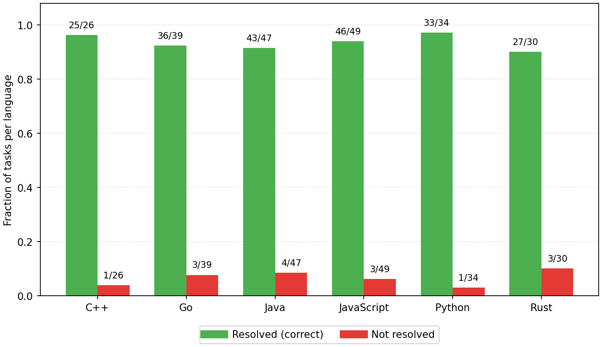

<p align="center">
  <a href="https://reallcz.github.io/MGM/">
    
  </a>
</p>

<p align="center">
  <a href="https://arxiv.org/abs/2608.07645"></a>
  <a href="https://reallcz.github.io/MGM/"></a>
  <a href="https://github.com/RealLcz/MGM"></a>
</p>

# Mendel Gödel Machine (MGM)

**Mendelian Evolution Self-Improving Coding Agent**

MGM extends the [Huxley Gödel Machine (HGM)](https://github.com/metauto-ai/HGM) framework with **mendelian evolution**: instead of improving agents only from their own failures, MGM also learns from successes and failures across lineages. The system maintains an evolutionary tree of coding agents and iteratively self-improves them using three complementary strategies while evaluating on SWE-bench or the Polyglot multi-language benchmark.

---

## Self-Improve Strategies

MGM samples among three strategies when expanding a tree node:

| Strategy | Name | Description |
|----------|------|-------------|
| **A** | Clonal Mutation | Improve from a single failed task on the selected node |
| **B** | Reaction-norm Mutation | Compare two tasks on the same node (requires ≥2 evals) |
| **C** | Cross-lineage Hybridization | Transfer capability from a peer lineage that solved a shared task |

Default MGM weights: **A : B : C = 0.1 : 0.45 : 0.45**. The HGM baseline uses strategy A only (`1.0 : 0.0 : 0.0`).

---

## Environment Setup

### Prerequisites

- **Linux** with **Slurm** (recommended) or a standalone machine with NVIDIA GPUs
- **Conda** (Python 3.11)
- **Docker** on a reachable host
- **SSH key access** to the remote Docker host
- **Hugging Face cache** for model weights (`HF_HOME`)

### 1. Clone and create the conda environment

```bash
git clone <your-repo-url> MendelGM
cd MendelGM

conda create -n HGM python=3.11 -y
conda activate HGM
pip install -r requirements.txt
```

Additional packages used by analysis scripts:

```bash
pip install vllm matplotlib pillow scikit-learn
```

### 2. Configure Docker

Evaluation runs inside Docker containers. You must provide your own Docker host — do not rely on any hard-coded address in the Slurm scripts; override it when submitting jobs.

**Local Docker** (GPU machine and Docker daemon on the same host):

```bash
export ENABLE_REMOTE_DOCKER=0
```

**Remote Docker via SSH** (typical on HPC compute nodes without a local daemon). Slurm scripts forward the remote host's Docker socket and reverse-tunnel vLLM so containers can reach the LLM:

```bash
export ENABLE_REMOTE_DOCKER=1
export REMOTE_DOCKER_USER=<your-ssh-user>
export REMOTE_DOCKER_HOST=<your-docker-host>
export REMOTE_DOCKER_SOCKET=/tmp/docker-remote.sock
```

| Variable | Purpose |
|----------|---------|
| `ENABLE_REMOTE_DOCKER` | `1` = SSH tunnel to remote Docker; `0` = local daemon |
| `REMOTE_DOCKER_USER` | SSH user on **your** Docker host |
| `REMOTE_DOCKER_HOST` | IP or hostname of **your** Docker host |
| `REMOTE_DOCKER_SOCKET` | Local path for the forwarded Docker socket |
| `REMOTE_DOCKER_PASSWORD` | Optional password auth via `sshpass` |

Example Slurm submission with your own Docker host:

```bash
REMOTE_DOCKER_USER=ubuntu REMOTE_DOCKER_HOST=your.vm.example.com sbatch swe_scripts/mgm.slurm
```

SWE-bench and Polyglot images are pulled or built automatically during evaluation as needed.

### 3. Edit configuration

Main config: [`config.yaml`](config.yaml). Polyglot runs use [`polyglot_scripts/config_polyglot.yaml`](polyglot_scripts/config_polyglot.yaml).

Key fields:

```yaml
llm:
  self_improve_llm: "Qwen/Qwen3-Coder-Next"
  downstream_llm: "Qwen/Qwen3-Coder-Next"

execution:
  max_workers: 2
  max_task_evals: 200

paths:
  output_dir: "<your_output_dir>"   # e.g. output_mgm/my_swe_run
  continue_from: null               # set to a prior run dir to resume, or null for fresh start
  initial_agent_name: "default_agent"
```

### 4. Verify vLLM connectivity (optional)

After starting a vLLM server:

```bash
python scripts/test_vllm_api_in_container.py
```

---

## Running Experiments

All Slurm jobs should be submitted from the **repository root**. Logs are written to `logs/`.

**Before submitting eval or resume jobs**, decide:

1. **`HGM_OUTPUT_DIR`** — where your run artifacts live (or where a new run should be written). Example: `output_polyglot/my_mgm_run`.
2. **Node to evaluate** — either the numeric **tree node id** from `hgm_metadata.jsonl`, or the **commit folder name** under that output dir (e.g. `<commit_id>`). Each evolved agent has its own subfolder with `metadata.json`.

To list nodes in a run:

```bash
python scripts/draw_hgm_tree.py --run-dir <your_run_dir> --out <your_run_dir>/hgm_tree.png
# Or inspect the last snapshot:
tail -n 1 <your_run_dir>/hgm_metadata.jsonl | python -m json.tool
```

### SWE-bench: MGM (comparative evolution)

Runs MGM with mixed strategies (A:B:C = 0.1:0.45:0.45). Set your output location:

```bash
HGM_OUTPUT_DIR=<your_output_dir> sbatch swe_scripts/mgm.slurm
```

Default model: `Qwen/Qwen3-Coder-Next`. Adjust `VLLM_MODEL_NAME`, `TENSOR_PARALLEL_SIZE`, and Slurm `--gres=gpu:N` to match your hardware.

### SWE-bench: HGM baseline (strategy A only)

Fresh run with strategy A only:

```bash
HGM_OUTPUT_DIR=<your_output_dir> sbatch swe_scripts/hgm.slurm
```

To force a clean start, ensure `config.yaml` has `continue_from: null` or pass `--continue_from null` via a custom invocation.

### Polyglot: evolution run

Evolution on the Polyglot benchmark (60-task subset: small + medium). If `HGM_OUTPUT_DIR` is unset, the Slurm script creates a timestamped folder under `output_polyglot/`:

```bash
HGM_OUTPUT_DIR=<your_output_dir> sbatch polyglot_scripts/hgm_polyglot.slurm
```

Common overrides:

```bash
# MGM strategy mix + your output directory
HGM_OUTPUT_DIR=<your_output_dir> \
SELF_IMPROVE_WEIGHT_A=0.1 SELF_IMPROVE_WEIGHT_B=0.45 SELF_IMPROVE_WEIGHT_C=0.45 \
sbatch polyglot_scripts/hgm_polyglot.slurm

# Resume: write to a new dir while loading tree from a prior run
HGM_OUTPUT_DIR=<your_new_output_dir> \
CONTINUE_FROM=<your_prior_run_dir> \
sbatch polyglot_scripts/hgm_polyglot.slurm

# Adjust evaluation budget
HGM_MAX_TASK_EVALS=100 HGM_OUTPUT_DIR=<your_output_dir> sbatch polyglot_scripts/hgm_polyglot.slurm
```

Default model: `Qwen/Qwen3.6-35B-A3B`. Adjust `VLLM_MODEL_NAME`, `TENSOR_PARALLEL_SIZE`, and Slurm `--gres=gpu:N` to match your hardware.

### Polyglot: full 225-task evaluation

After evolution, evaluate **your chosen node(s)** on the complete Polyglot benchmark. Replace the placeholders with your run directory and node id(s):

```bash
HGM_OUTPUT_DIR=<your_run_dir> \
EVAL_NODE_IDS="<node_id_or_commit_id>" \
sbatch polyglot_scripts/eval_full_polyglot.slurm
```

Examples:

```bash
# Single node by tree id
HGM_OUTPUT_DIR=output_polyglot/my_run EVAL_NODE_IDS="16" sbatch polyglot_scripts/eval_full_polyglot.slurm

# Multiple nodes
HGM_OUTPUT_DIR=output_polyglot/my_run EVAL_NODE_IDS="16 20" sbatch polyglot_scripts/eval_full_polyglot.slurm

# By commit folder name instead of tree id
HGM_OUTPUT_DIR=output_polyglot/my_run EVAL_NODE_IDS="<commit_id>" sbatch polyglot_scripts/eval_full_polyglot.slurm
```

Set `EVAL_FORCE=1` to rerun all 225 tasks. Use `EVAL_DRY_RUN=1` to list pending tasks without launching Docker.

### SWE-bench: evaluate remaining tasks

Run a node on SWE tasks not yet in its `metadata.json`. By default the script picks the best node under `HGM_OUTPUT_DIR`; override with your node:

```bash
HGM_OUTPUT_DIR=<your_run_dir> sbatch swe_scripts/eval_remaining.slurm

# Or specify the node explicitly (tree id or commit folder name)
HGM_OUTPUT_DIR=<your_run_dir> \
EVAL_NODE_ID=<node_id_or_commit_id> \
sbatch swe_scripts/eval_remaining.slurm
```

### Direct invocation (without Slurm)

With vLLM already running and `DOCKER_HOST` configured:

```bash
conda activate HGM

python hgm.py \
  --config config.yaml \
  --output_dir <your_output_dir> \
  --continue_from null \
  --max_task_evals 200 \
  --self_improve_weight_a 0.1 \
  --self_improve_weight_b 0.45 \
  --self_improve_weight_c 0.45

# Polyglot
python hgm.py \
  --config polyglot_scripts/config_polyglot.yaml \
  --polyglot \
  --output_dir <your_output_dir> \
  --continue_from null
```

### Useful environment variables (Slurm jobs)

| Variable | Description |
|----------|-------------|
| `REMOTE_DOCKER_USER` | SSH user on your Docker host |
| `REMOTE_DOCKER_HOST` | IP/hostname of your Docker host |
| `ENABLE_REMOTE_DOCKER` | `1` remote Docker via SSH; `0` local Docker |
| `VLLM_MODEL_NAME` | Hugging Face model ID for vLLM |
| `HGM_MAX_WORKERS` | Parallel self-improve / eval workers |
| `MGM_CUDA_VISIBLE_DEVICES` | Override GPU indices (debug only) |
| `VLLM_PORT` | vLLM API port (default 8000) |
| `GPU_MEMORY_UTILIZATION` | vLLM GPU memory fraction |
| `HGM_OUTPUT_DIR` | Directory for run artifacts (you choose the path) |
| `EVAL_NODE_ID` | SWE-bench: node id or commit folder to evaluate |
| `EVAL_NODE_IDS` | Polyglot full eval: one or more node ids / commit folders |
| `CONTINUE_FROM` | Prior run directory when resuming evolution |
| `HGM_CONFIG` | Path to YAML config |

---

**Draw an evolution tree** (replace with your run directory):

```bash
python scripts/draw_hgm_tree.py \
  --run-dir <your_run_dir> \
  --out <your_run_dir>/hgm_tree.png
```

---

## Experimental Results

Example figures from completed MGM/HGM runs are in [`docs/assets/images/`](docs/assets/images/). Your own artifacts are written to whatever `HGM_OUTPUT_DIR` you set (typically under `output_mgm/` or `output_polyglot/`, gitignored).

### Polyglot: accuracy by language (full 225-task eval)

After running `eval_full_polyglot.slurm` on your chosen node, aggregate accuracy by language from that node's `metadata.json`:

| Metric | Example |
|--------|---------|
| **Overall** | **210 / 225 resolved (93.3%)** |
| C++ | 25 / 26 |
| Go | 36 / 39 |
| Java | 43 / 47 |
| JavaScript | 46 / 49 |
| Python | 33 / 34 |
| Rust | 27 / 30 |



### SWE-bench (60-task subset)

During the default 200-eval search budget, resolve rates on the small + medium subset vary by node. Use `eval_remaining.slurm` with your `HGM_OUTPUT_DIR` and optional `EVAL_NODE_ID` to finish unevaluated tasks.

---

## Repository Structure

```
MendelGM/
├── hgm.py                  # Main evolution loop
├── self_improve_step.py    # Self-improvement (diagnose + patch)
├── config.yaml             # Default SWE-bench / MGM config
├── swe_scripts/            # Slurm jobs for SWE-bench (mgm.slurm, hgm.slurm, eval_remaining.slurm)
├── polyglot_scripts/       # Slurm jobs and config for Polyglot
├── scripts/                # Utilities (tree viz, eval helpers)
├── swe_bench/              # SWE-bench harness and task subsets
├── polyglot/               # Polyglot harness and task subsets
├── initial_swe/            # Seed agent for SWE-bench (generated at runtime)
├── initial_polyglot/       # Seed agent for Polyglot (generated at runtime)
├── prompts/                # Self-improvement prompt templates
├── utils/                  # Docker, git, eval helpers
├── SWEbench_Pro/           # SWE-bench Pro evaluation tools (separate benchmark)
├── docs/assets/images/     # Result figures for this README / project page
├── output_mgm/             # SWE-bench run artifacts (gitignored)
└── output_polyglot/        # Polyglot run artifacts (gitignored)
```

Each run directory contains:

- `hgm_metadata.jsonl` — tree snapshots over time
- `init_evaluated_tasks.json` — tasks seen during search
- `<commit_id>/metadata.json` — per-node accuracy and task IDs
- `<commit_id>/predictions/` — agent outputs and eval logs

---

## Using OpenAI and Other Models

The default Slurm workflows start a local **vLLM** server for open-weight models (e.g. Qwen). You can also run experiments with **hosted APIs** — no GPU or vLLM required for the LLM itself (Docker is still needed for benchmark evaluation).

Set your API key and point the config at the model you want:

```bash
export OPENAI_API_KEY=<your-api-key>
```

In `config.yaml` (or via CLI flags):

```yaml
llm:
  self_improve_llm: "gpt-5"
  downstream_llm: "gpt-5"
  diagnose_llm: "gpt-5"
```

Or on the command line:

```bash
python hgm.py \
  --config config.yaml \
  --output_dir <your_output_dir> \
  --self_improve_llm gpt-5 \
  --downstream_llm gpt-5 \
  --diagnose_llm gpt-5
```

Supported backends are defined in [`llm.py`](llm.py), including OpenAI models (`gpt-5`, `o3`, `o4-mini`), vLLM-served models (`Qwen/...`, `google/...`), and OpenRouter (`OpenRouter_API_KEY`).

---

## Community & Co-Contributors

**We warmly welcome the community to try MGM with other models and different benchmarks** — different LLMs, API providers, local serving setups, or evaluation suites beyond SWE-bench and Polyglot. If you run new experiments and get updated results (on SWE-bench, Polyglot, new models, or different evolution settings), **feel free to reach out to us** — we would love to explore working together as co-contributors, whether that means sharing figures, benchmark numbers, reproduction notes, or code improvements back to the project.

Open a GitHub issue or pull request with your findings, or contact the maintainers directly. Feedback, bug reports, and fresh data all help make MGM better for everyone.

---

## Acknowledgements

This codebase is adapted from the [DGM](https://github.com/jennyzzt/dgm) and [HGM](https://github.com/metauto-ai/HGM) self-improving agent framework. Polyglot benchmark harness follows the [polyglot-benchmark](https://github.com/Aider-AI/polyglot-benchmark) format.

---

## Citation

If you find MGM useful in your research, please cite:

```bibtex
@misc{liu2026mendelgodelmachinerecursive,
      title={Mendel G\"odel Machine: Recursive Self-Improving Coding Agents via Comparative Evolution}, 
      author={Changzhi Liu and Yilun Liu and Sikuan Yan and Volker Tresp and Yunpu Ma},
      year={2026},
      eprint={2608.07645},
      archivePrefix={arXiv},
      primaryClass={cs.AI},
      url={https://arxiv.org/abs/2608.07645}, 
}
```
